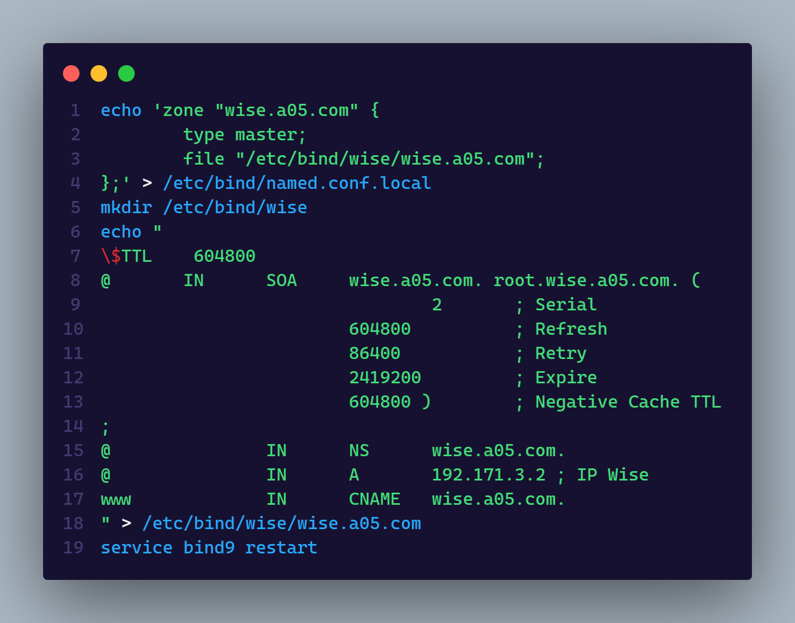

# Kelompok A05

- 5025201020 - Muhammad Ferdian Iqbal
- 5025201039 - Abd. Wahid
- 5025201197 - Abidjanna Zulfa Hamdika
    

### Initial Project

 

### 1. Semua node terhubung ke router Ostania sehingga dapat mengakses internet

 

 

### 2. Akses wise.yyy.com dengan alias www.wise.yyy.com pada folder wise

 

 

### 3. Subdomain eden.wise.yyy.com dengan alias www.eden.wise.yyy.com

 

 

### 4. Reverse domain untuk domain utama

 

 

### 5. DNS Slave di Berlint

 

 

### 6. Subdomain yang khusus untuk operation yaitu operation.wise.yyy.com dengan alias www.operation.wise.yyy.com

 

 

### 7. Subdomainmelalui Berlint dengan akses strix.operation.wise.yyy.com dengan alias www.strix.operation.wise.yyy.com

 

 

### 8. Webserver dengan DocumentRoot pada /var/www/wise.yyy.com

 

 

### 9. Url www.wise.yyy.com/index.php/home dapat menjadi www.wise.yyy.com/home

 

 

### 10. Pada subdomain www.eden.wise.yyy.com, Loid membutuhkan penyimpanan aset yang memiliki DocumentRoot pada /var/www/eden.wise.yyy.com

