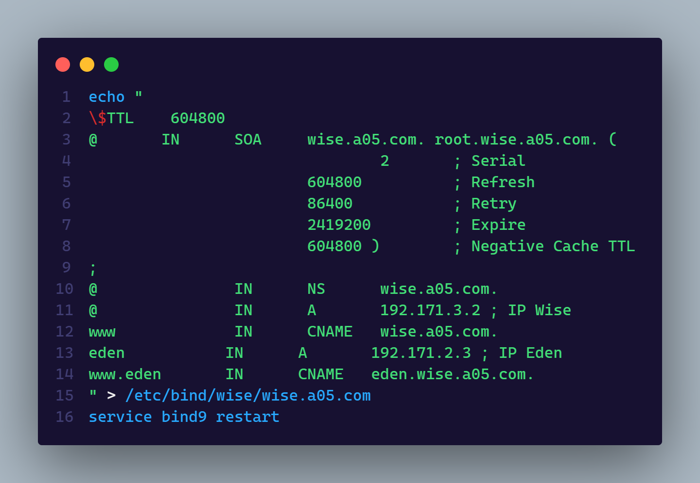
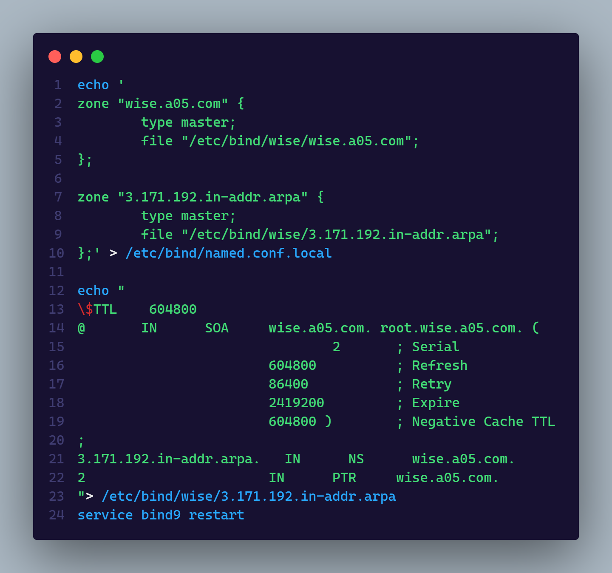

# Kelompok A05

- 5025201020 - Muhammad Ferdian Iqbal
- 5025201039 - Abd. Wahid
- 5025201197 - Abidjanna Zulfa Hamdika
    

### Initial Project

> wise.a05.com

 

 

### 1. Semua node terhubung ke router Ostania sehingga dapat mengakses internet

 

 

### 2. Akses wise.yyy.com dengan alias www.wise.yyy.com pada folder wise

> Pada script tersebut, agar dapat mengakses alias www.wise.yyy.com maka diperlukan konfigurasi di file named.conf.local dan file di /etc/bind/wise/wise.a05.com. Dengan menambahkan konfigurasi CNAME maka www.wise.yyy.com akan bisa diakses

 

 

### 3. Subdomain eden.wise.yyy.com dengan alias www.eden.wise.yyy.com

> Pada script tersebut, diperlukan konfigurasi tambahan pada file wise.a05.com. Konfigurasi tersebut berupa penambahan A dengan IP mengarah ke IP eden dan penambahan alias CNAME www.eden.

 

 

### 4. Reverse domain untuk domain utama

 

 

### 5. DNS Slave di Berlint

 

 

### 6. Subdomain yang khusus untuk operation yaitu operation.wise.yyy.com dengan alias www.operation.wise.yyy.com

 

 

### 7. Subdomainmelalui Berlint dengan akses strix.operation.wise.yyy.com dengan alias www.strix.operation.wise.yyy.com

 

 

### 8. Webserver dengan DocumentRoot pada /var/www/wise.yyy.com

 

 

### 9. Url www.wise.yyy.com/index.php/home dapat menjadi www.wise.yyy.com/home

 

 

### 10. Pada subdomain www.eden.wise.yyy.com, Loid membutuhkan penyimpanan aset yang memiliki DocumentRoot pada /var/www/eden.wise.yyy.com

 

 

### 11. Pada folder /public, Loid ingin hanya dapat melakukan directory listing saja

 

 

### 12. Error file 404.html pada folder /error untuk mengganti error kode pada apache

 

 

### 13. Membuat konfigurasi virtual host. Virtual host ini bertujuan untuk dapat mengakses file asset www.eden.wise.yyy.com/public/js menjadi www.eden.wise.yyy.com/js

 

 

### 14. www.strix.operation.wise.yyy.com hanya bisa diakses dengan port 15000 dan port 15500

 

 

### 15. Autentikasi username Twilight dan password opStrix dan file di /var/www/strix.operation.wise.yyy

 

 

### 16. Mengakses IP Eden akan dialihkan secara otomatis ke www.wise.yyy.com

 

 

### 17. Mengubah request gambar yang memiliki substring “eden” akan diarahkan menuju eden.png.

